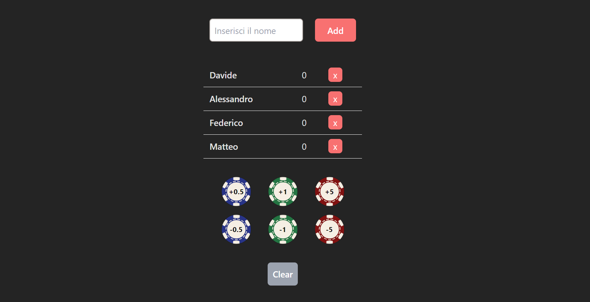

# Password Game

### About:

A user-friendly mobile application designed for tracking scores in various games. It leverages local storage to ensure that all added players and their scores are preserved even after the app is closed. Users can easily add or remove points, providing a seamless and reliable experience for game score management.

### Demo:

### Technologies Used:

### Packages Used:

-   [React Grid System](https://www.npmjs.com/package/react-grid-system)
-   [Use Local Storage](https://www.npmjs.com/package/use-local-storage?activeTab=readme)
